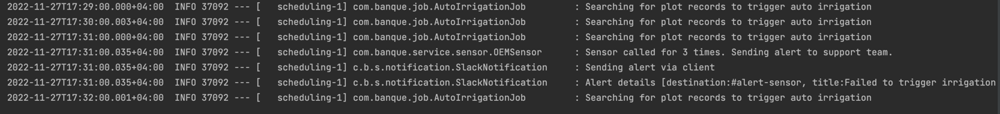

# Automatic irrigation system

### Running the application
Navigate the project directory and run the command `./gradlew bootrun` and it will start the service: `http://localhost:8080`

You can also open this project directly from the IDE and run it. 

### Prerequisite
Java version 17

Gradle 7.4


### Database
For demo puporses, H2 database was used to ensure that no additional database configuration is required when the project is starting up. Two demo plots was added to the service at startup to allow us play with the endpoint.

```
2022-11-27T17:26:24.799+04:00  INFO 37052 --- [           main] c.banque.AutomaticIrrigationApplication  : Started AutomaticIrrigationApplication in 5.095 seconds (process running for 5.423)
2022-11-27T17:26:24.801+04:00  INFO 37052 --- [           main] com.banque.DataBootstrap                 : Saving demo data in the database
2022-11-27T17:26:24.842+04:00  INFO 37052 --- [           main] com.banque.DataBootstrap                 : Saved plot Plot(id=1, longitude=12345679, latitude=12345678, lastUpdatedDate=2022-11-27, nextIrrigationDate=null, crop=Watermelon)
2022-11-27T17:26:24.847+04:00  INFO 37052 --- [           main] com.banque.DataBootstrap                 : Saved plot Plot(id=2, longitude=43456793, latitude=23456782, lastUpdatedDate=2022-11-27, nextIrrigationDate=null, crop=Grape)
2022-11-27T17:26:24.847+04:00  INFO 37052 --- [           main] com.banque.DataBootstrap                 : Saving plot config for plot 1
202
```
### Plot Endpoints
##### Get All Plots
To retrieve all plots in the services, call this endpoint from postman or curl 
GET: `http://localhost:8080/api/v1/plot/all`

Response: 200(OK)
```json
{
    "status": "success",
    "plots": [
        {
            "id": 1,
            "longitude": "12345679",
            "latitude": "12345678",
            "lastUpdatedDate": "2022-11-27",
            "crop": "Watermelon",
            "slots": [
                {
                    "id": 1,
                    "plotId": 1,
                    "irrigationTime": "12:03:10",
                    "waterRequired": 44.5,
                    "status": "completed"
                }
            ]
        },
        {
            "id": 2,
            "longitude": "43456793",
            "latitude": "23456782",
            "lastUpdatedDate": "2022-11-27",
            "crop": "Grape",
            "slots": [
                {
                    "id": 2,
                    "plotId": 2,
                    "irrigationTime": "12:03:10",
                    "waterRequired": 44.5,
                    "status": "completed"
                }
            ]
        }
    ]
}
```

##### Save Plot
Save a new plot information
POST: `http://localhost:8080/api/v1/plot/create`

RequestBody: application/json
```json
{
    "longitude": "12345679",
    "latitude": "12345678",
    "lastUpdatedDate": "1970-01-21",
    "crop":"Maggie"
}
```

Response: 201(CREATED)
```json
{
  "status": "success",
  "plot": {
    "id": 4,
    "longitude": "12345679",
    "latitude": "12345678",
    "lastUpdatedDate": "1970-01-21",
    "nextIrrigationDate": null,
    "crop": null,
    "slots": null
  }
}
```

##### Get Plot By Id
Get a specific plot by id
GET: `http://localhost:8080/api/v1/plot/1`

Response: 200(OK)
```json
{
    "status": "success",
    "plot": {
        "id": 1,
        "longitude": "12345679",
        "latitude": "12345678",
        "lastUpdatedDate": "2022-11-27",
        "crop": "Watermelon",
        "slots": [
            {
                "id": 1,
                "plotId": 1,
                "irrigationTime": "13:52:00",
                "waterRequired": 44.5,
                "status": "completed"
            }
        ]
    }
}
```

#### Configure Plot
To configure a slot for a plot, provide the id of the plot in the url path variable and submit the slot information
Request : application/json
POST: `http://localhost:8080/api/v1/plot/create-slot/1`
```json
{
  "daily": true,
  "weekly": false,
  "monthyl": false,
  "waterRequired": 40.4,
  "irrigationTime": "02:30:00"
}
```

Response : 200(OK)
```json
{
    "status": "success",
    "message": "Time slot saved for plot 1 at time 02:30"
}
```

#### Update plot
Update plot using the slot id in the path variable and add the request body
PUT: `http://localhost:8080/api/v1/plot/update/1`

Response: 200(OK)
```json
{
    "status": "success",
    "plot": {
        "id": 1,
        "longitude": "12345679",
        "latitude": "12345678",
        "lastUpdatedDate": "2022-11-27",
        "crop": "Watermelon",
        "slots": [
            {
                "id": 1,
                "plotId": 1,
                "irrigationTime": "13:52:00",
                "waterRequired": 44.5,
                "status": "completed"
            }
        ]
    }
}
```

### Automatic Detection System
Thi service contains a job that runs every minute and query the slots for plots of land to watered. The query retrieves all plots within the minute of that slot and send the information to the active sensor.

### Alert System
The sensor has a mock implementation that contains a Retry mechanism that allows the `startIrrigation` method to be called for up to three times before sending the notification through a configured notification system.
```
2022-11-27T17:31:00.000+04:00  INFO 37092 --- [   scheduling-1] com.banque.job.AutoIrrigationJob         : Searching for plot records to trigger auto irrigation
2022-11-27T17:31:00.035+04:00  INFO 37092 --- [   scheduling-1] com.banque.service.sensor.OEMSensor      : Sensor called for 3 times. Sending alert to support team.
2022-11-27T17:31:00.035+04:00  INFO 37092 --- [   scheduling-1] c.b.s.notification.SlackNotification     : Sending alert via client
2022-11-27T17:31:00.035+04:00  INFO 37092 --- [   scheduling-1] c.b.s.notification.SlackNotification     : Alert details [destination:#alert-sensor, title:Failed to trigger irrigation for 2, message:Kindly investigate why the sensor is failing to trigger irrigation.]

```